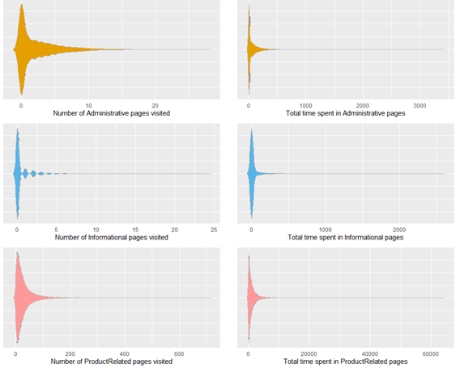
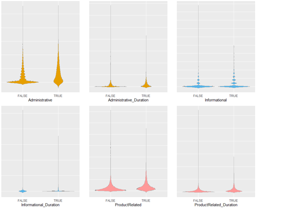
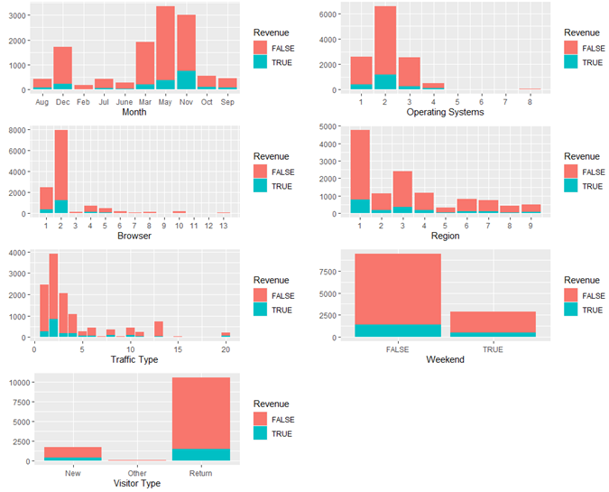
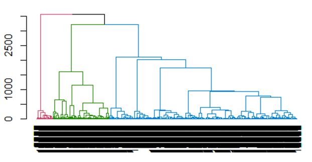

# Data-Science-portfolio-1
This is a repository containing  portfolio of data science projects which I worked on with my M.Sc students.

For more visually pleasant experience for browsing  the portfolio, check [here]()

Contents
---------
# [Project 1: Segmenting Customers of Different Products](https://github.com/ibkAfolabi/Data-Science-portfolio-1/blob/main/DataScienceGroup1.R)
  
  The focus of this project is to be able to segment existing customers into clusters and study their characteristics so as to use this information to know what kind of prospects   to target. We intent to cluster the prospects to see if their characteristics match our existing customers and target them.
  
  Tasks involved;
  
    •	Visualize the data to discover outlier if any.
    
    •	Apply hierarchical clustering with Euclidean distance and Ward’s method. 
    
    •	Compare the cluster centroid to characterize the different clusters, and try to give each cluster a label.
    
    •	To check the stability of the clusters.
    
    •	Determine the most suitable k.
    
    •	Use k-means clustering to get the clusters in the data using the most suitable
    
    •	Create the profile of each clusters
    
    •	Which clusters would you target for offers, and what types of offers would you target to customers in that cluster
    
    
    
    
    
    
   

# [Project 2: Start-Up /  Market Exploration]()
-  add description on the projects

- [Project 3: Combining Association Rule Mining and Social Network Analysis]()
-  add description on the projects

- [Project 4: Classification i.e Predicting Categrical Outcome]()
-  add description on the projects
 
- [Project 5: Prediction i.e. Predicting Numerical Outcome]()
-  add description on the projects

 Credit
 -------
Some of the questions and data for these projects was gotten from 
DATA MINING FOR BUSINESS ANALYTICS Concepts, Techniques, and Applications in R Book of 2018 book
